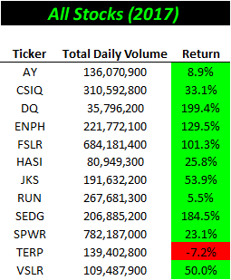
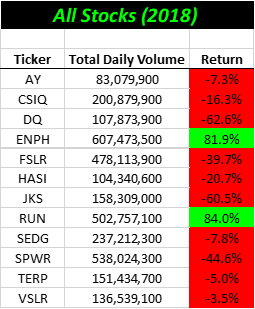

# Stock-Analysis

## Overview of Project
Refactor our code used to analyze the small stock market dataset in Module 2 to run more efficiently so that it can be used to analyze stock volumes and returns on larger datasets quickly. 
### Purpose
Determining if refactoring our code made it run more efficiently. 
## Analysis

### Analysis of efficiency gained by refactoring 

- Refactored Code
  -  
- Original Code
  -  
  
The graphics above show the execution times of both the original code and the refactored code. The refactored code ran 86.5% and 85.9% more efficiently for 2017 and 2018 respectively. 

By creating the tickerIndex variable we were able to loop through the dataset one time rather than once for each stock ticker.  

### Analysis of Stock Performance

The graphics below show the total trade volumes and the % return for the each of the individual "green" stocks in 2017 and 2018.

 

Although the trade volume changed very little between 2017 and 2018 (up 4.4%) the average returns dropped significantly. In 2017 the year over year average rate of return was a eye popping 67.3%, in 2018 the year over year return dropped all the way into the red at -8.5% on average. In 2017 11 out of the 12 stocks analyzed had a positive rate of return, 4 of which increased by over 100%. In 2018 it was a much different story with only 2/12 stocks having a positive return and 2 stocks losing over 50% of their value. 

What caused this cosmic shift from 2017 to 2018? Was it connected to changes in regulataions or politics, can it be attibuted to micro or macroeconomic factors?  

It's difficult to pinpoint the exact driver of the shift using only this dataset which includes but a small subset of the overall market. A quick google search shows us the the market as a whole saw lower returns and higher volatility in 2018 compared to 2017. 
(Source:[2017 vs. 2018 in the Stock Market](https://awealthofcommonsense.com/2019/01/2017-vs-2018-in-the-stock-market/#:~:text=In%202017%20the%20S%26P%20500,markets%20by%20more%20than%209%25.))

### Challenges and Difficulties Encountered
Although there were minimal issues faced performing this analysis, the volume issue stated above can makes it difficult to make confident recommendations based on more granular criteria elements. 
## Results

- Outcomes based on Launch Date conclusions.
  - Months with higher volumes of launched campaigns tend to have higher success rates. 
  - Even though May typically has the highest volume of new campaign launches it is still the most attractive month from a rate of success standpoint. 

- Outcomes based on Goals conclusions. 
  - We generally see a deterioration in the rate of successs as the campaign goal increases (again - difficult to extract meaningful conclusions from the higher goal buckets)
  - While only 31% of campaigns have a goal greater than 5k the same population accounts for nearly 46% of failed campaigns.  

- Dataset limitations.
  - There are relatively few records in the data which makes it difficult to disect more granular categories. 
  - We have no way to measure elements not listed in the data set, specifically the visual factors that help determine a campaigns success/failure. 
  
- What are some other possible tables and/or graphs that we could create?
  - Layer both goals and launch dates to see if the results change significantly when working in tandem.  
  - Determine success rates based on the campaign funding window (difference between the date created and the date ended) and visulaize the results on a line chart. 
