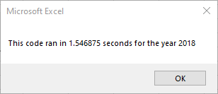

# Stock-Analysis

## Overview of Project
Refactor our code used to analyze the small stock market dataset in Module 2 to run more efficiently so that it can be used to analyze stock volumes and returns on larger datasets quickly. 
### Purpose
Determining if refactoring our code made it run more efficiently. 
## Analysis and Challenges

### Analysis of efficiency gained by refactoring 
The graphics below show the execution times of both the original code and the refactored code. The refactored code ran 86.5% and 85.9% more efficiently for 2017 and 2018 respectively. 
- Refactored Code
  - 
  - 
- Original Code
  - 
  - 
  

The top graphic shows that the late spring early summer months generally have the highest volumes of new campaign launches, May leads the way followed by June and July. Not only do May, June, and July have the highest launch volumes but also the highest rate of success as shown in the bottom graphic above. December on the other hand has both the lowest launch volume and success rate.
### Analysis of Outcomes Based on Goals
The graphics below show outcomes based on campaign funding goal within the Play subcategory (analysis based on 1,047 unique campaigns launched between 2010-2017). 

The "Outcomes Based on Goal" graphic above shows that the campaigns with the highest rate of success are in the found within the two lowest goal buckets (76% and 73% respectively). Although there is an elevated rate of success for the 35k-40k and 40k-45k buckets, the volumes are too low (see "Goal Volumes and Outcomes" chart above) to draw any meaningful conclusions. 
### Challenges and Difficulties Encountered
Although there were minimal issues faced performing this analysis, the volume issue stated above can makes it difficult to make confident recommendations based on more granular criteria elements. 
## Results

- Outcomes based on Launch Date conclusions.
  - Months with higher volumes of launched campaigns tend to have higher success rates. 
  - Even though May typically has the highest volume of new campaign launches it is still the most attractive month from a rate of success standpoint. 

- Outcomes based on Goals conclusions. 
  - We generally see a deterioration in the rate of successs as the campaign goal increases (again - difficult to extract meaningful conclusions from the higher goal buckets)
  - While only 31% of campaigns have a goal greater than 5k the same population accounts for nearly 46% of failed campaigns.  

- Dataset limitations.
  - There are relatively few records in the data which makes it difficult to disect more granular categories. 
  - We have no way to measure elements not listed in the data set, specifically the visual factors that help determine a campaigns success/failure. 
  
- What are some other possible tables and/or graphs that we could create?
  - Layer both goals and launch dates to see if the results change significantly when working in tandem.  
  - Determine success rates based on the campaign funding window (difference between the date created and the date ended) and visulaize the results on a line chart. 
